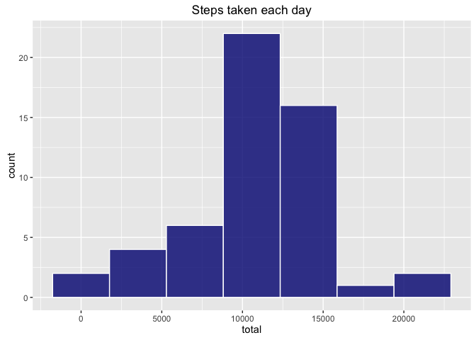
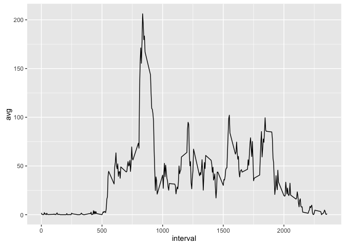
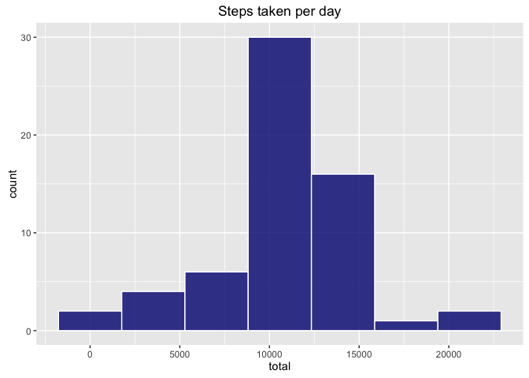
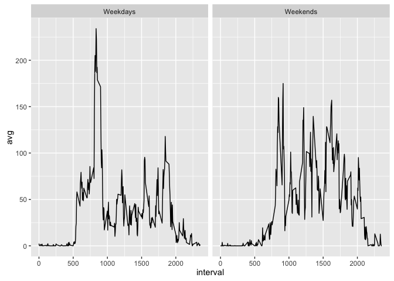

**1. Code for reading in the dataset and/or processing the data**

Loading necessary libraries for the project and unzipping the dataset
from the cloud using `data.table`.

    library(data.table)
    library(dplyr)
    library(ggplot2)
    library(timeDate)

    data <- fread("curl https://d396qusza40orc.cloudfront.net/repdata%2Fdata%2Factivity.zip | funzip")

**2. Histogram of the total number of steps taken each day**

Creating data.frame with the sum of steps taken daily and corresponding
histogram (omitting missing values).

    total_steps = data %>% na.omit %>% group_by(date) %>% summarise(total=sum(steps))

    ggplot(total_steps, aes(total)) + geom_histogram(bins=7, col="white", fill="navyblue", alpha=.8)+labs(title="Steps taken each day")

**3. Mean and median number of steps taken each day**

Estimators calculated after omitting missing values.

    mean(total_steps$total, na.rm = TRUE)

    ## [1] 10766.19

    median(total_steps$total, na.rm = TRUE)

    ## [1] 10765

**4. Time series plot of the average number of steps taken**

Averaging steps taken across all 5-min intervals and corresponding plot.

    avg_5_min = data %>% na.omit %>% group_by(interval) %>% summarise(avg=mean(steps))

    ggplot(avg_5_min, aes(x=interval,y=avg))+geom_line()

**5. The 5-minute interval that, on average, contains the maximum number
of steps**

According to data, between 8:35 and 8:40 a.m., subject takes more steps
on average, around 206.

    max = avg_5_min %>% top_n(1, avg)

    max

    ## # A tibble: 1 × 2
    ##   interval      avg
    ##      <int>    <dbl>
    ## 1      835 206.1698

**6. Code to describe and show a strategy for imputing missing data**

When evaluating data, it is possible to see that column "steps" from
original data is missing 2304 observations. The imputation method will
be taking 5-min interval average to fill all missing values, as it can
be seen in the next code chunk. After imputing values, the new dataset
does not contain "NA's" anymore.

    sapply(data, function(x) sum(is.na(x)))

    ##    steps     date interval 
    ##     2304        0        0

    data_na= data %>%
         group_by(interval) %>% 
          mutate_each(funs(replace(., which(is.na(.)),
                                    mean(., na.rm=TRUE))))

    sapply(data_na, function(x) sum(is.na(x)))

    ##    steps     date interval 
    ##        0        0        0

**7. Histogram of the total number of steps taken each day after missing
values are imputed**

After imputing values, it is possible to see that distribution changed a
little bit, more cases fall into the middle bin.

    total_stepsb = data_na %>% group_by(date) %>% summarise(total=sum(steps))

    ggplot(total_stepsb, aes(total)) + geom_histogram(bins=7, col="white", fill="navyblue", alpha=.8)+labs(title="Steps taken per day")

**Mean and median after imputing values with method described above**

Mean and median were not really affected after imputing values, actually
only median changed from 10,765 to 10,766.19.

    mean(total_stepsb$total)

    ## [1] 10766.19

    median(total_stepsb$total)

    ## [1] 10766.19

**8. Panel plot comparing the average number of steps taken per 5-minute
interval across weekdays and weekends**

Contrary to the pattern during weekdays, on weekends, more activity is
registered in the afternoon. For weekdays, only the morning shows a
higher level of activity.

    data_wk = data %>% mutate(wk= as.numeric(isWeekday(date, wday=1:5)))

    data_wk$wk=replace(data_wk$wk,data_wk$wk==1, "Weekdays")

    data_wk$wk=replace(data_wk$wk,data_wk$wk==0, "Weekends")

    avg_5_mine = data_wk  %>% na.omit %>% group_by(interval,wk) %>% summarise(avg=mean(steps))

    ggplot(avg_5_mine, aes(x=interval,y=avg))+geom_line() + facet_grid(.~wk)

